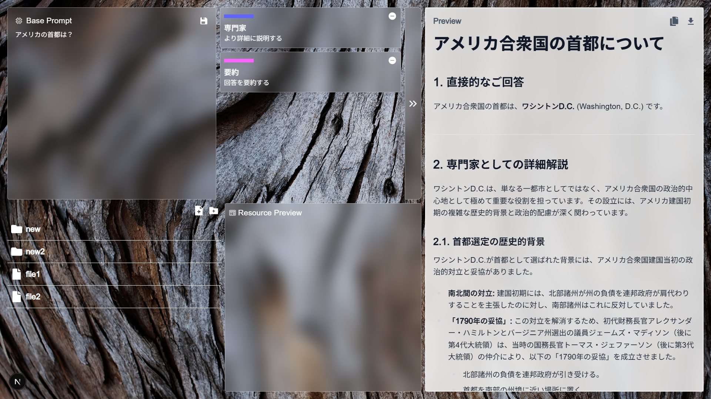

# 生成AIプロンプト管理サービス「Prompt Pot」
「蓄積・共有・活用」 を可能にする、プロンプト資産化サービス 。 

チームが使ったプロンプトをストックし、誰でもすぐに呼び出せる仕組みを提供します。 
これにより、AI活用の 効率化・標準化・資産化 を実現し、個人に依存しないナレッジ共有を可能にします。 

AIを活用した業務のスピードと品質を飛躍的に高め、組織全体の競争力を強化します。 

## 構想🔦
**「プロンプト＝資産」** であり、その価値を最大限高める。 
普段私たちががAIに入力している「プロンプト」こそ、AI活用において最大の資産である。 
その資産価値を最大限生かすための、システムを提供する。 

### プロンプトを保存、再利用する
プロンプトは保存して再利用すべし！ 
多くの人が、生成AIを利用するとき、様々なプロンプトを試行錯誤しながら作成しています。 
その試行錯誤していく中に役に立つプロンプトを発見を発見することがあります。これを**その場限りのものにするのは大変もったいない**。 
多くの人、様々な場面で使える、資産になりうるものです。 
だからこそ、発見できたプロンプトは保存しておき、いつでも再利用できる状態にしていくことを目指します。 

### プロンプトを分解して考える
プロンプトはその内容をジャンルごとに分解してとらえることで、利用価値を大きく高めます。 
プロンプトというものは、実際にはいくつかの役割をもった部品が集まって構成されています。 
その部品ごとにプロンプトを分解し、扱うことで**様々な分野でも応用**でき、プロンプトの再利用の価値をより大きなものにします。 
ここでは、プロンプトは
- 「指示」
- 「コンテキスト」
- 「フォーマット」
- 「制約条件」

に分解して、扱っています。 
プロンプトを再利用するときは、必要な部品をそれぞれもってくることで柔軟なプロンプト設計を可能にします。

### コンテキストを効率的に管理する
生成AIを効果的に利用するには、**正しいコンテキストの管理が必要不可欠**です。 
コンテキストとは、今おかれた状況や背景のことであり、こういった情報をAIに渡すことで、より精度の高い回答が得られます 
生成AIの出力が上手くいかない大きな理由の一つが、このコンテキストの不足です。 
例えば「○○の案を考えて」や「○○についての説明を書いて」だけの単純な質問では、AIはどういった意図もって質問されているかを知らないため、
趣旨のずれた回答をしがちです。
 これはモデルの性能に関係なく起こりえます。 
事前に自分が置かれた状況や、必要となる知識を与えてあげることで「役に立つ」、本当に必要な回答がもらえます。 
 
しかしながら、従来のチャット形式でこのコンテキストを管理するのは大変手間がかかります。
なぜなら、

- 毎回入力する必要がある
- コンテキストを保存する場所が存在しない
- コンテキストの共有を前提としたサービスがない

といった問題が存在するからです。 
そこで、本サービスではプロンプトの管理の一環として、このコンテキストの管理も可能にします。 
生成AIの実行ごとにコンテキストを入力するのではなく、いつでもアクセス可能な「リソース」として、ワンクリックで追加できるようにします 
これは特に、**チームを超えてコンテキストを利用**するとき大きな恩恵が得られます。 
例えば、生成AIを使って、新サービスの広報文を作るときを考えてみます。エンジニアチームが作った機能リスト、マーケティングチームが作ったターゲット情報をコンテキストとして、各チームに保存してもらえれば、それらを共有することで、瞬時に必要な情報がそろったプロンプトを作成できます。

## 機能⚙
### 画面構成

### ①プロンプトエリア
プロンプトエリアは、これから生成したいコンテンツの指示文を入力します。 
「ベースプロンプト」と「追加プロンプト」に分かれており、素早く高度なプロンプトを作成することが可能です。 

#### ベースプロンプト
今から実行する**タスク特有のプロンプト**を入力する場所です。 
プロンプトエンジニアリングなどで扱われる、出力の精度を上げるためのプロンプトなどは「追加プロンプト」から設定できるため、**必要事項を簡潔に書く**だけで済みます。 
また、コンテキストといわれる、背景情や追加の情報も、「追加プロンプト」として扱うことで、入力の手間を大幅に減らせます。 
ボイラープレートを避け、生成AI活用への効率化を上げることができます。

#### 追加プロンプト
ベースプロンプトに付け加える、**追加設定用のプロンプト**です。 
リソースエリアにある、プロンプトリストから追加できます。 
ベースプロンプト単体だけでは実現できない、**高度なプロンプトの設計**を可能にします。 
生成AIの効果的な利用には、適切なプロンプトの設計は必要不可欠です。 
単にしてほしいことを命令するだけでなく、背景にある情報や出力形式を入力することで、より精度の高い結果を出力できます。 
また、特定のタスクの精度を上げるのに特化したプロンプトなども存在します。 
そのようなプロンプトはパッケージとして保存しておき、再利用するのが効率的です。 
 
プロンプトはジャンルごとに分かれており、左上に色づけされ、理解しやすいデザインになってます。 
ワンクリックでプロンプトを追加することが可能で、手間のかかる**高度なプロンプトも簡単**に作れます。

### ②リソースエリア
「追加プロンプト」に追加するためのプロンプトが保存されている場所です。 
フォルダ・ファイル形式で保存されており、**必要な情報に素早くアクセス**できます。 
プロンプトはジャンルごとに分解し、保存する形式を採用しており、これにより**高い再利用性**を実現します。 
また、チーム・個人の枠を超えて同じリソースを共有するため、一人一人の成果を全体で最大限活用できます。 
例えば、誰かが出内容をより良いものにする「プロンプトを発見」したとします。これはその場限りのものでもなく、その人だけの知恵にぜず、「リソース」として保存することで**チーム全体の財産**として機能します 
また、コンテキストの管理という点でも重要です。 
あるチームで作成した情報をコンテキストとして保存しておけば、ほかのチームがコンテンツを作成するとき、素早く情報にアクセスして活用することができます 
右側にはリソースのプレビュー画面があり、リソースの内容を確認することができます

### ③プレビュー画面
ここでは実際に生成した結果を確認できます。 
結果はマークダウンとして出力されます。 
出力内容はコピーとダウンロードが可能となっています。 

## 内部構成🔩

